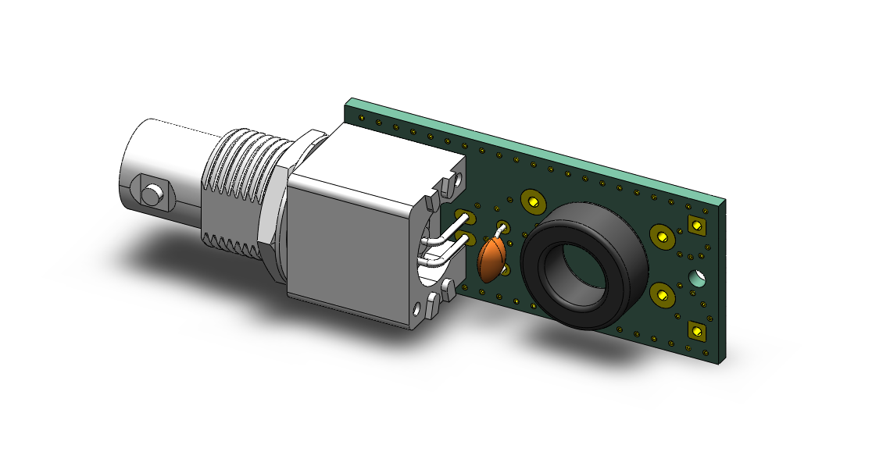
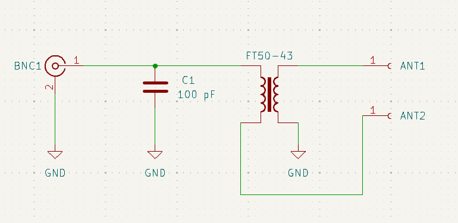
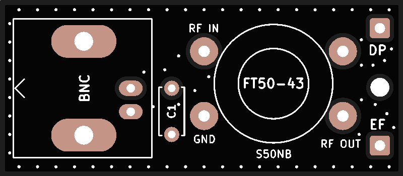

# QRP PCB UnUn/BalUn

*Simple, small, light and portable.*

The main point of portable QRP operation is to be as light as possible, especially for those of us who enjoy SOTA and POTA activations. Its based off a well known design (If I knew who the original designer was I would credit him on the design). Modified to work both as a UnUn for EFHW and random wire antennas, as well as a 1:1 or 4:1 BalUn for regular or OCF dipoles or even loops if desired. 

For EFHW you can stack the toroids and wind 21 turn on them with a tap at the third turn for the RF connection. This should in theory give better efficiency and so not wasted power for heating. This is specially important for qrp radios do to low power output.

For those interested theres alot said about it here [SOTA Reflector efhw debate](https://reflector.sota.org.uk/t/a-sota-centric-end-fed-half-wave-antenna-part-1/24756/11)

I have also added STEP files for those of you who would like to 3d print different enclosures. 

BOM:

- FT50-43 ferrite toroid
- 1x 100nf 3kV ceramic THT capacitor 
- 1x BNC Right Angle PCB Jack Through Hole Bulkhead Rear Mount 50 Ohm Isolated (Amphenol 031-5486 for instance)
- 0.3mm(28AWG) or 0.5mm(24AWG) enameled copper wire (As long as you can wind 14 turns around the toroid, any size you have will do actually)

## 3D Render

## Schematic

## PCB

